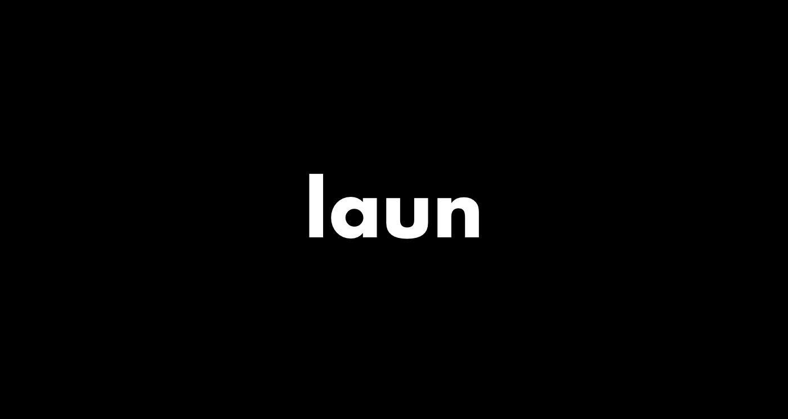

# laun is a simple applicatin launcher on cli

## Installing(requires Go 1.11.4)
```shell
$ export GO111MODULE=auto
$ go get -u github.com/NasSilverBullet/laun/cmd/laun
```

## Usage
```shell
$ laun [apps] [flags]
```

## Flags
```shell
-h, --help            help for laun
-l, --list            show application list
-t, --target string   select target file or directory
```

## You can do this for example with the following command
```shell
$ laun Docker
$ laun docker            // You can use lower case
$ laun doc               // You can use a part of apps name
$ laun Docker Firefox    // You can luanch multiple applications at the same time
$ laun Atom -t README.md // You can launch with each file or directory
$ laun -l                // You can check your applicatin list
````